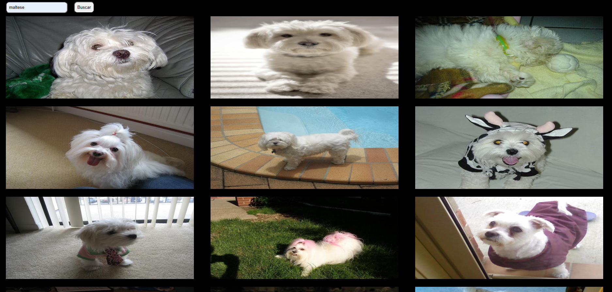

# Site Dogs

## Site
É um site feito com Html, CSS e JS, em que nele o JS consome a Dog API e cria as fotos de cachorro de acordo com a raça que o usuário digitar.

## Tecnologias utilizadas para criar o site
* HTML
* CSS
* JS
* Dog API

## Autor
[Gustavo Pereira](https://www.linkedin.com/in/gustavo-pereira-dev-redes)
